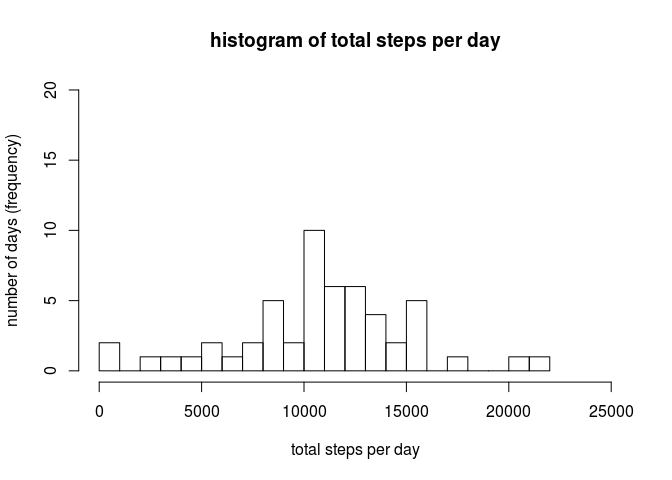
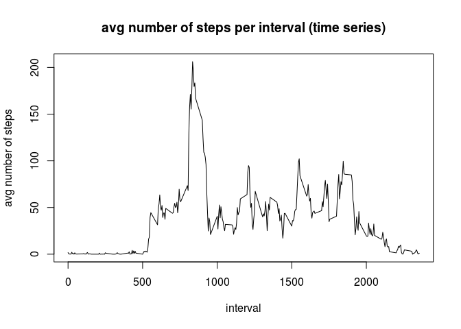
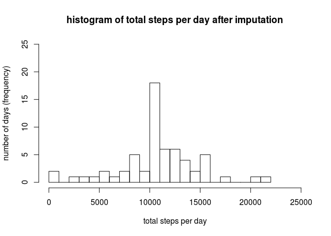
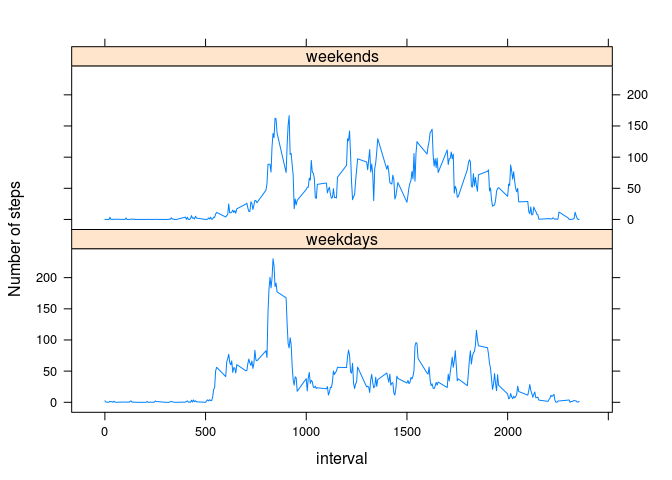

# Reproducible Research: Peer Assessment 1
Remember to setwd to main folder for this peer assessment

## Loading and preprocessing the data

Read the data, convert variable with date information to date format.
NB The strptime function includes the run date (=today) in the result 
so that has to be removed b4 reporting.

```r
options(digits = 10)
activity       <- read.csv("data/activity.csv")
dateasdate     <- as.Date(activity$date, "%Y-%m-%d")
intervalastime <- strptime(formatC(activity$interval[2], width = 4, flag = "0"), "%H%M")
```

## What is the mean total number of steps taken per day?  
Calculate the total steps per day. If a day only has only missing values (NA) the total number of steps is also missing. Use the total steps per day to calculate the mean and median total steps per day. For this mean and median, exclude the days that have only missing values. Create a histogram of the total number of steps per day.  

```r
totalstepsperday       <- tapply(activity$steps, activity$date, sum, na.rm = FALSE)
meantotalstepsperday   <- mean(totalstepsperday, na.rm = TRUE)
mediantotalstepsperday <- median(totalstepsperday, na.rm = TRUE)
hist(totalstepsperday, ylim = c(0, 20), xlim = c(0, 25000), breaks = 20
     , main = "histogram of total steps per day"
     , ylab = "number of days (frequency)"
     , xlab = "total steps per day")
```

 
  
The mean total steps per day is 10766.19.  
The median total steps per day is 10765.

## What is the average daily activity pattern?
Calculate the average number of steps per interval. Report the interval that has the maximum average number of steps.

```r
avgstepsperinterval <- tapply(activity$steps, activity$interval, mean, na.rm=TRUE)
intervals           <- unique(activity$interval)
plot(intervals, avgstepsperinterval, type="l"
     , main="avg number of steps per interval (time series)"
     , xlab="interval", ylab="avg number of steps")
```

 

```r
maxinterval         <- intervals[which.max(avgstepsperinterval)]
```

Across all the days in the dataset the interval at 835 contains the maximum average number of steps, which is 206.17.

## Imputing missing values
Calculate the total number of rows with NAs.

```r
totalmissingvalues <- sum(apply(activity, FUN=anyNA, MARGIN=1))
```
The total number of rows with NAs is 2304.  (Checked: The only variable with NAs is steps)

Fill in the NAs for steps with the average number of steps for that interval. Round the average to the nearest integer to make more sense. Create a new dataset that is equal to the original dataset but with the missing data filled in.

```r
imputemissing <- function(x) {
    if (is.na(x['steps'])) round(avgstepsperinterval[which(intervals == as.numeric(x['interval']))])
    else x['steps']
}
activitynew       <- activity
activitynew$steps <- as.integer(apply(activity, FUN=imputemissing, MARGIN=1))
```


```r
totalstepsperdayimputed       <- tapply(activitynew$steps, activitynew$date, sum)
meantotalstepsperdayimputed   <- mean(totalstepsperdayimputed)
mediantotalstepsperdayimputed <- median(totalstepsperdayimputed)
hist(totalstepsperdayimputed, ylim=c(0,25), xlim=c(0,25000), breaks=20,
main="histogram of total steps per day after imputation", ylab = "number of days (frequency)", 
xlab = "total steps per day")
```

 

The mean total steps per day after imputation is 10765.64.  
The median total steps per day after imputation is 10762.

Imputing missing data in this way increases kurtosis. The mean and median remain approximately the same. 
Imputation increased the total number of steps from 570608 to 656704. The maximum total steps per day remained the same (21194) because all NAs were caused by missing entire days.

## Are there differences in activity patterns between weekdays and weekends?

```r
activitynew$weekday <- factor(ifelse(as.POSIXlt(dateasdate)$wday %in% c(0,6), 1, 0)
                              , labels=c("weekdays", "weekends"))

avgstepsperinterval <- aggregate(activitynew$steps
                                 , by=list(activitynew$interval
                                           , activitynew$weekday)
                                 , FUN=mean, na.rm=TRUE)
library(lattice)
xyplot(avgstepsperinterval$x ~ avgstepsperinterval$Group.1 | avgstepsperinterval$Group.2
       , type="l", ylab = "Number of steps", xlab = "interval", layout = c(1, 2))
```

 

On weekdays, as compared to the weekends, this person seems to get up earlier in the morning, there is a more distinguished peak in activity during the morning rush hour and the number of steps tapers off a little earlier in the evening.
